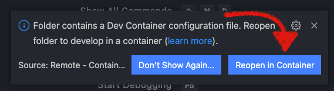
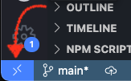
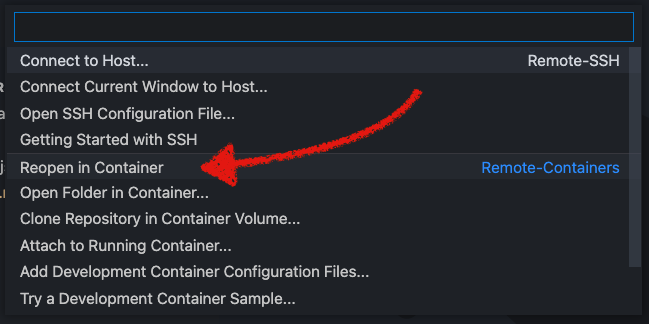

# Dev Containers

A common pattern across many HYPR projects is the use of containerised development environments. This serves a number of purposes:
- Creates a consistent environment across different developers' machines (regardless of OS)
- Makes the development environment more similar to cloud deployments
- You'll need much fewer tools installed and set up to get started (making switching between different projects easier too!)

## Requirements

#### For the containers:
- Git client
- Docker Desktop ([MacOS](https://docs.docker.com/desktop/mac/install/)/[Windows](https://docs.docker.com/desktop/windows/install/)) or [Docker Engine](https://docs.docker.com/engine/install/) (Linux)

#### To develop directly inside a container:
- [Visual Studio Code](https://code.visualstudio.com/Download)
  - VSCode Remote Development Extension 
- [DevContainer CLI](https://code.visualstudio.com/docs/remote/devcontainer-cli) (optional)

This repo contains an example for a containerised Node.js API, but the concepts are applicable anywhere (for example, here is a [.NET template](https://github.com/RimuTec/dev-container-dotnet).)

## A Development Container
There are two folders of note in this repo, `dev` and `.devcontainer`. The folder `dev` relates to the set up of the Docker container(s), while `.devcontainer` contains config specifically for running VSCode inside the dev container. Let's start in the `dev` folder.

> Note that in some repos, these files may be consolidated into one folder. They will work the same regardless, but have been separated in this example to better distiguish between container and VSCode config.

### Dockerfile
A Dockerfile describes a list of steps to build a Docker container. 

The Dockerfile for our example container is very simple - we begin with a Node.js base image. Node comes with `npm` pre-installed, but we are also running a command to ensure we get the latest version.

We then set the active user inside the container to `node` (the `node` user was created by the Node image we used above). By default, applications run inside a Docker container have root privileges, including on any mounted directories. This poses a security risk, making it important to set a non-root user so processes and commands running inside the container do not have root permissions, nor have `sudo` available. If the image you're using doesn't create a non-root user, you can create one in the Dockerfile (you may see this in other projects.)

The Dockerfiles you come across may be more complex, for example creating the non-root user, or installing certain tools inside the container. However, they all serve the same purpose - building an image of everything we need for our development environment.

### docker-compose.yml
`docker-compose` allows us to coordinate multiple Docker containers that are intended to be used together. In this example, we have the development container (the `api` service) and a separate `db` service for a local DynamoDB database.

An explanation of the different components of the `docker-compose.yml` file can be found in comments in the file.

### Building and running the container
To create and start the container run the following from the root of this repo:
```sh
cd dev
docker-compose up -d

# Or alternatively, just
docker-compose -f dev/docker-compose.yml up -d
```
The first time you run this it may take a few minutes, as images will need to be pulled and built. In future, new versions of any images - or a Docker update - will result in this taking a few minutes again, but otherwise subsequent starts to the container should only take a few seconds.

Note that the `-d` flag runs the command in detached mode, so we get our terminal back once the container is running.

You should now be able to run the command `docker ps` and see the `hypr-dev-container` and `hypr-example-db` containers listed.

---

Running the following command from `./dev` will connect you to an interactive terminal inside the container:
```sh
docker-compose exec api bash # executes the command `bash` in the api container
```
Here, you should have access to the Node.js environment. Try running the `index.js` file with the command: `node index.js`.

`pwd` should show that you are at `/example` (as we defined in our `docker-compose` file), and `ls` should output the contents of this repo mounted in the container.

The `whoami` command should print the user you are running as: `node`.

As you built out your app, you can now perform tasks - such as running your test suite or spinning up the API locally - from inside the container. This way, all developers are seeing results from the same environment.

You can hit `ctrl + D`, or type `exit` to exit the container back to your main terminal.

---
To stop the containers, run:
```
docker-compose down
```

You will typically find these commands wrapped in scripts. Our convention, as you'll find in the `package.json` of this repo, has scripts for the above commands as follows:
```
> docker:dev:up
> docker:dev:connect
> docker:dev:down
```

You may also see the format of simply `dev:up` from time to time.

If you have a preferred IDE to VSCode, you can stop here. The following section relates to opening VSCode inside your dev container.

## Developing in the container with VSCode

With the VSCode extension `Remote Development`, you can use the Docker container as a fully featured development environment - you can even commit and push code changes from within the container. VSCode will start and stop the container for you, and terminals opened inside of VSCode are inside the container. Essentially, you can forget the above scripts! :wink:

Config for this is in the `devcontainer.json` file inside of the `.devcontainer` directory. Comments in the file describe the purpose of each property in the config object.

### Opening VSCode inside the container

Once you have the Remote Development extension installed, from your terminal, open this directory in VSCode:
```
code .
```

After a few seconds, the extension will detect the `devcontainer` config and you should receive a popup to `Reopen in Container` as shown below.



If you don't receive this popup, or it disappears, you can also reopen the current folder inside the container by clicking the DevContainer icon in the bottom left of VSCode:



And then selecting Reopen in Container from the menu.


Either way, VSCode will take a moment to start the containers (building the images first if it needs to), install your VSCode environment in the container, configure it based on the `devcontainer.json` settings (i.e. installing extensions) and connect your local copy of VSCode to the VSCode server now running in your container.

To ensure everything is working as expected, you can open a new terminal inside of VSCode (ctrl + \`). Running `node -v` should output `v16.13.0`, as that's the version of Node our Docker image is using.

In the VSCode Extensions tab, you should see - `under Dev Container: Example Dev Container - Installed` - the extensions defined in the `devcontainer.json`.

> Note that any environment changes (changes to any of the config files we've gone through, or new environment variables) will require you to rebuild the container.


### Devcontainer CLI

To skip the open VSCode > Reopen in Container step, the [DevContainer CLI tool](https://code.visualstudio.com/docs/remote/devcontainer-cli) allows you to open VSCode inside the development container directly with the command `devcontainer open .`. Follow the instructions linked to set up the CLI tool.


### Extra Reading

For more, see [this Medium article](https://medium.com/swlh/building-a-dev-container-for-net-core-e43a2236504f) by [Manfred Lange](https://github.com/ManfredLange).